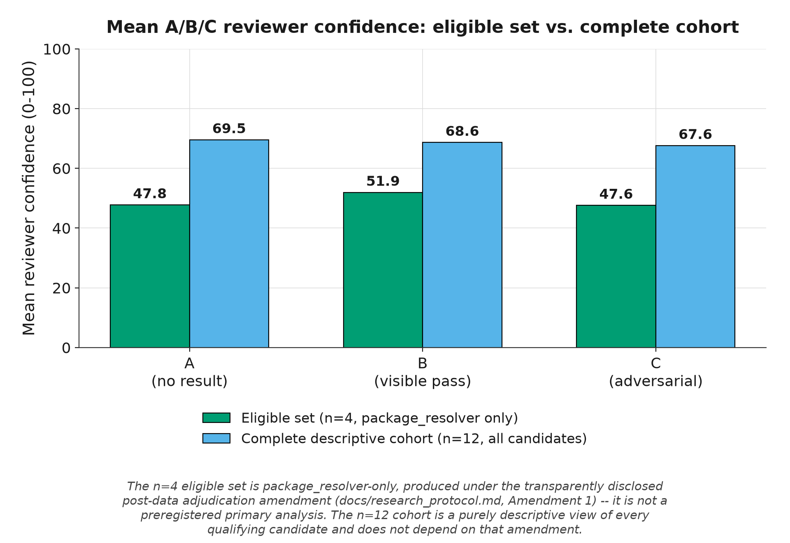
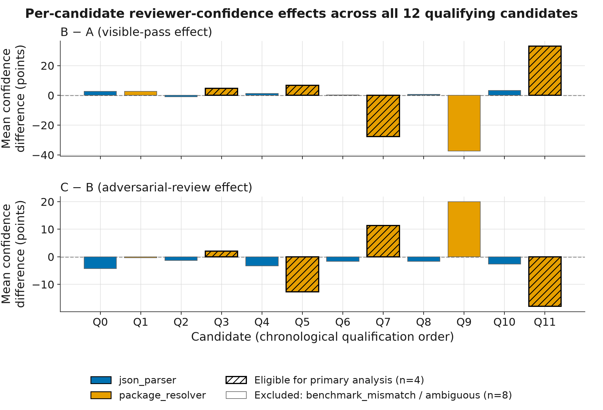
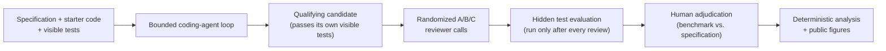
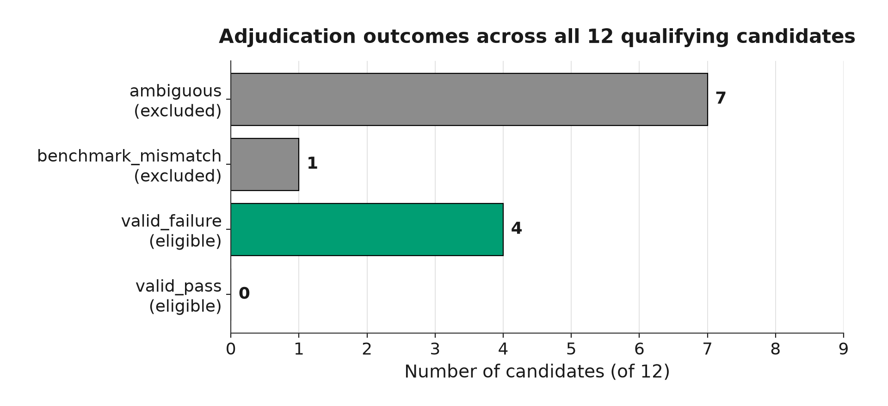

# VeriGate

Does telling an AI code reviewer "the visible tests passed" make it more
confident a solution will pass tests it can't see?

[](https://github.com/varunm354/verigate/actions/workflows/ci.yml)
[](./LICENSE)
[](./backend/requirements.txt)
[](./frontend/package.json)

[**Explore the live research dashboard →**](https://verigate-fawn.vercel.app)

## Overview

VeriGate is a small, controlled research platform for studying a specific
failure mode in AI-assisted code review: whether reporting that a
solution's **visible** (public) tests passed inflates a reviewer's stated
confidence that it will also pass **hidden** (withheld) tests, independent
of whether that confidence is actually warranted. An independent
coding-agent loop generates candidate implementations for two small Python
tasks; an LLM reviewer is asked the identical calibration question under
three controlled conditions that differ only in what it is told about
visible-test results; a private hidden-test suite (never seen during
generation or review) then supplies ground truth; and a human adjudicates
any benchmark-validity disputes before a deterministic analysis pipeline
computes the results below. Every step from candidate generation through
final figure generation is scripted, seeded, and reproducible from
committed, sanitized artifacts.

## Results at a glance

| Scope | n | Task coverage | Mean A | Mean B | Mean C | B−A | C−B |
|---|---|---|---|---|---|---|---|
| **Eligible set** (post-data adjudication amendment) | 4 | `package_resolver` only | 47.750 | 51.917 | 47.583 | **+4.167** | **−4.333** |
| **Complete descriptive cohort** | 12 | `json_parser` (6) + `package_resolver` (6) | 69.528 | 68.639 | 67.583 | −0.889 | −1.056 |

Benchmark pass rate across the full cohort: **0/12** — every qualifying
candidate failed at least one hidden test.

**These are two different, non-interchangeable views and must not be
conflated:**

- The **eligible set (n=4)** is the primary estimand evaluated on the
  eligible set produced under the transparently disclosed post-data
  adjudication amendment. The A/B/C conditions and the primary/secondary
  estimand (mean paired `B−A` / `C−B` per candidate) were preregistered in
  [`docs/research_protocol.md`](docs/research_protocol.md) before any data
  was collected. The specific rule that decides *which* candidates count
  as eligible was **not** preregistered — it was added after all 12
  candidates' data had already been collected and inspected (see
  "Benchmark-validity and adjudication findings" below). It is **not**
  simply "the preregistered primary analysis," it is package_resolver-only,
  and at n=4 it is illustrative, not statistically conclusive.
- The **complete cohort (n=12)** is a purely descriptive view of every
  qualifying candidate this campaign produced, regardless of adjudication
  category. It does not depend on the eligibility rule at all.





This is an **exploratory** study (n≤12 candidates, one generator model,
one reviewer model, two small self-contained Python tasks). Nothing here
implies statistical significance, causality beyond this specific
controlled setup, generality across coding tasks or languages, or general
claims about reviewer behavior. See "Limitations" below.

## Research question

Does telling an AI code reviewer that visible tests passed increase its
estimated probability that a candidate will pass a private (hidden) test
suite, and can an adversarial-review instruction reduce that effect?

## Experimental conditions

Three controlled reviewer conditions, identical in every other respect
(specification, candidate source, visible-test source, and the exact
calibration question asked):

| Condition | What the reviewer is told, beyond spec + code + visible tests |
|---|---|
| **A — `A_NO_RESULT`** | Nothing about whether visible tests were run or passed. |
| **B — `B_VISIBLE_PASS`** | One added, plain factual sentence: all visible tests passed. |
| **C — `C_ADVERSARIAL`** | Same statement as B, plus an instruction to actively search for missing requirements, uncovered edge cases, and weaknesses in the visible-test suite before answering. |

Every reviewer call answers the same question: *"What is the probability,
from 0 to 100, that this exact candidate will pass the private evaluation
suite?"* — asked 3 times per condition per candidate (9 calls/candidate,
108 total), in a seeded-random per-repetition order, always **before**
that candidate's hidden tests are ever run.

## How it works



Hidden tests are structurally unreachable until every reviewer observation
for a candidate already exists — the orchestrator never invokes them
earlier, and permanent regression tests enforce this ordering and the
absence of hidden-test content anywhere upstream of it.

## Methodology

- **Tasks:** `json_parser` and `package_resolver`, two small self-contained
  Python library tasks adapted from
  [SpecBench](third_party/specbench/README.md) (Weco AI, Apache-2.0).
- **Candidate generation:** a bounded coding-agent loop (≤3 attempts) sees
  only the specification, starter code, visible tests, and its own prior
  attempt's visible-test feedback — never hidden tests. Every candidate
  that ever passes its own visible tests is included in the study
  (no cherry-picking); none were excluded or regenerated based on hidden
  results.
- **Cohort:** 12 qualifying candidates (6 `json_parser` + 6
  `package_resolver`), 0 generation attrition, 108 reviewer observations
  (12 × 9), all preregistered in [`docs/research_protocol.md`](docs/research_protocol.md).
- **Ground truth:** all 12 candidates passed their own visible tests; all
  12 failed at least one hidden test in the private suite.
- **Adjudication:** because every candidate failed at least one hidden
  test, a human adjudicator classified *why*, per
  [`docs/research_protocol.md`](docs/research_protocol.md)'s adjudication
  policy, into `valid_failure`, `benchmark_mismatch`, or `ambiguous` — see
  next section.

## Findings

- Across the **complete 12-candidate cohort**, mean confidence was similar
  across A/B/C (69.5 / 68.6 / 67.6) — no meaningful visible-pass or
  adversarial effect is visible once every candidate (regardless of why
  it failed hidden tests) is included.
- Within the smaller **n=4 eligible set** (candidates whose hidden-test
  failures are unambiguous specification violations, all
  `package_resolver`), mean confidence was substantially lower overall
  (47.8 / 51.9 / 47.6) and showed a larger *directional* B−A increase
  (+4.167) and C−B decrease (−4.333). At n=4, this is a descriptive,
  illustrative pattern in one small subset of one task — not a
  statistically established effect, and it should not be generalized
  beyond this specific sample.
- The two views disagree in direction as often as they agree, which is
  itself the most important honest finding here: at this sample size, the
  eligibility rule you apply after the fact can visibly change the
  apparent story, which is exactly why both views are reported side by
  side rather than collapsed into one number.

## Benchmark-validity and adjudication findings

Every one of the 12 qualifying candidates failed at least one hidden
test — but "failed a hidden test" does not always mean "the candidate was
wrong":



- **`valid_failure` (4):** the candidate genuinely violates an explicit,
  written specification requirement (e.g. a version-comparison crash that
  the spec's ordering rule directly contradicts).
- **`benchmark_mismatch` (1):** the hidden test's own expectation
  contradicts an explicit specification rule — a benchmark-suite defect,
  not a candidate defect. (The project's very first pilot observation,
  predating preregistration, is this same pattern: a `json_parser`
  candidate correctly rejecting `NaN`/`Infinity` per the spec's explicit
  "No Infinity, NaN, or hex" rule, while the hidden suite expected them
  accepted — see [`docs/pilot_findings.md`](docs/pilot_findings.md).)
- **`ambiguous` (7):** the failure depends on behavior the specification
  never clearly addresses either way (e.g. a documented
  `package_resolver` circular-dependency edge case), so no defensible
  "correct" answer exists from the written spec alone.

This classification only became necessary once each candidate's actual
failure cause was inspected — i.e. **after** all data collection was
complete. `docs/research_protocol.md`'s "Amendment 1" (dated 2026-09-20,
a pure textual append, never an edit of the original preregistered text)
adds the precedence rule used to assign one category per candidate when a
candidate has more than one failure cause. This amendment is what shrinks
the primary-analysis-eligible set from up to 12 down to 4, and it is
disclosed here, in the protocol, and in the analysis report exactly as
that: a **post-data** methodological decision, not a preregistered one.

See [`research/adjudications.json`](research/adjudications.json) for the
full per-candidate evidence and
[`research/results/8449581e-4097-4865-bfae-5cd8e9aef83f/README.md`](research/results/8449581e-4097-4865-bfae-5cd8e9aef83f/README.md)
for the complete sanitized analysis report.

## Limitations

- **Exploratory, small-n study.** At most 12 candidates across 2 tasks;
  the primary-eligible subset is 4. No p-values, confidence intervals, or
  claims of statistical significance are computed or implied anywhere in
  this project.
- **Single generator model, single reviewer model** (`gpt-5.6-luna` for
  both), which may introduce self-consistency effects and does not
  generalize to other models.
- **Only two small, self-contained Python tasks.** Results may not
  generalize to other languages, task shapes, or larger systems.
- **The eligible subset is package_resolver-only.** `json_parser`
  contributed zero eligible candidates in this campaign, so the n=4
  numbers cannot speak to that task at all.
- **Adjudication is a qualitative human judgment.** Several `ambiguous`
  classifications are genuinely disputable; a different, still-defensible
  reading of a task's specification could change which candidates are
  eligible and shift the n=4 numbers. See `evidence.reasoning` per
  candidate in [`research/adjudications.json`](research/adjudications.json).
- **No causal claim.** This is a controlled prompt-framing comparison, not
  evidence about real-world reviewer or human behavior beyond this exact
  setup.

## Repository structure

```
backend/
  app/               FastAPI app (health check only so far)
  experiment/         Core harness: tasks, conditions, prompts, reviewers,
                       candidate generation, experiment/campaign
                       orchestration, campaign analysis, figure generation
  tasks/              json_parser, package_resolver, expression_evaluator
  tests/              Backend test suite (pytest)
  data/               Gitignored raw artifacts (experiments, candidates,
                       campaigns) — never committed, never read by figures
docs/
  research_protocol.md  Preregistered exploratory protocol + amendments
  pilot_findings.md     Pre-protocol pilot observation (benchmark_mismatch)
research/
  adjudications.json    Per-candidate benchmark/specification adjudications
  results/<campaign_id>/  Sanitized, deterministic campaign analysis output
  figures/               Deterministic public figures generated from
                          research/results/ (see research/figures/README.md)
third_party/
  specbench/          Apache-2.0 attribution + file-by-file mapping for the
                       imported SpecBench task material
frontend/             Next.js app (not yet deployed)
```

## Quick start

### Backend (Python 3.12)

```bash
cd backend
python3.12 -m venv .venv
source .venv/bin/activate   # Windows: .venv\Scripts\activate
pip install -r requirements.txt
uvicorn app.main:app --reload --host 127.0.0.1 --port 8000
```

Health check: [http://127.0.0.1:8000/health](http://127.0.0.1:8000/health)

### Frontend (Next.js)

```bash
cd frontend
npm install
npm run dev
```

Open [http://localhost:3000](http://localhost:3000). The dashboard is a
local development app only — it is **not** deployed anywhere yet.

## Running tests

```bash
# Backend (from backend/, with the virtualenv active)
pytest

# Frontend (from frontend/)
npm run lint
npm run build
```

CI (`.github/workflows/ci.yml`) runs both on every push/PR to `main`; see
the badge above for current status.

## Reproducing the committed analysis (no API calls)

The sanitized analysis in
[`research/results/8449581e-4097-4865-bfae-5cd8e9aef83f/`](research/results/8449581e-4097-4865-bfae-5cd8e9aef83f/)
and the figures in [`research/figures/`](research/figures/) are already
committed — you can read them directly with no setup at all.

To regenerate the **public figures** from that already-committed,
sanitized analysis output (deterministic, no network access, no
`backend/data/` access):

```bash
cd backend
source .venv/bin/activate
python -m experiment.cli generate-figures
```

Regenerating the **analysis itself** (`analysis.json`/CSVs) requires the
original raw campaign artifacts under `backend/data/campaigns/` — those
are gitignored and only exist locally for whoever ran the campaign; they
are not part of this repository. If you have them, the same read-only,
no-API-call command that produced the committed output is:

```bash
python -m experiment.cli campaign-analyze --campaign-id <campaign-uuid>
```

## Running a new campaign (paid, requires `OPENAI_API_KEY`)

> **⚠️ This makes real, billed OpenAI API calls.** Every step below is
> optional and is never required to read, verify, or reproduce the
> results already in this repository.

```bash
cp .env.example .env   # then paste in a real OPENAI_API_KEY

cd backend
source .venv/bin/activate

python -m experiment.cli campaign-create \
  --generator-provider openai --generator-model gpt-5.6-luna \
  --reviewer-provider openai --reviewer-model gpt-5.6-luna \
  --target-per-task 6 --repetitions 3 \
  --generation-seed-start 42 --reviewer-seed-start 1000 \
  --cutoff 2026-09-21T12:00:00-07:00

python -m experiment.cli campaign-run --campaign-id <campaign-uuid>
python -m experiment.cli campaign-analyze --campaign-id <campaign-uuid>
python -m experiment.cli generate-figures
```

`--provider mock` is available on every underlying command
(`experiment`, `generate-candidate`) for free, deterministic, no-network
pipeline testing — see inline `--help` and the module docstrings under
`backend/experiment/` for the full command reference.

## Links

- [`docs/research_protocol.md`](docs/research_protocol.md) — preregistered
  protocol, ground-truth/adjudication policy, and amendments
- [`docs/pilot_findings.md`](docs/pilot_findings.md) — the pre-protocol
  pilot observation
- [`research/adjudications.json`](research/adjudications.json) — per-candidate
  adjudication records
- [`research/results/8449581e-4097-4865-bfae-5cd8e9aef83f/`](research/results/8449581e-4097-4865-bfae-5cd8e9aef83f/) —
  sanitized campaign analysis (JSON + CSV + README)
- [`research/figures/README.md`](research/figures/README.md) — figure
  generation and chart interpretation
- [`third_party/specbench/README.md`](third_party/specbench/README.md) —
  SpecBench attribution and file-by-file mapping

## License and attribution

VeriGate is licensed under the [Apache License 2.0](LICENSE). See
[NOTICE](NOTICE) for required attribution, including that parts of the
benchmark task materials are adapted from
[SpecBench](https://github.com/WecoAI/SpecBench) (Weco AI), also
Apache-2.0 — see [`third_party/specbench/README.md`](third_party/specbench/README.md)
for the complete file-by-file attribution.
